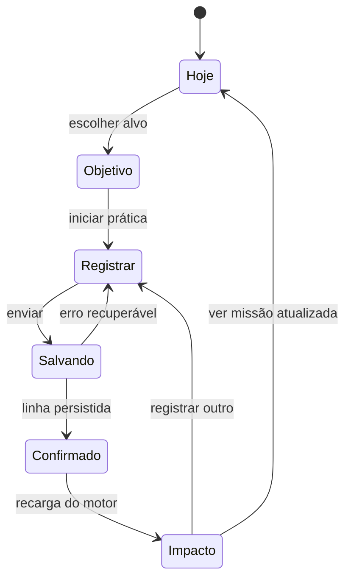

# UXG2 — jornada vertical do aluno

Base da revisão: `473abe0`

Escopo: Hoje → objetivo → Registrar → confirmação → Hoje atualizado.

## Decisão

O UXG2 não deve espalhar efeitos do login por todas as telas. A intensidade precisa ter níveis:

| Momento | Intensidade | Motivo |
|---|---:|---|
| Login | Cinematográfica | Apresenta a promessa e cria desejo de entrar |
| Hoje | Direcional | Mostra uma missão e um próximo movimento |
| Registro | Concentrada | Reduz atrito e comunica o que será gravado |
| Confirmação | Alta e curta | Celebra apenas o que o servidor confirmou |
| Histórico e administração | Baixa | Favorece leitura e operação |

Assim o login não promete uma experiência que desaparece, mas o miolo também não vira uma tela de jogo que compete com o estudo.

## Problema real encontrado

Hoje, os componentes já estão conectados ao banco, mas a jornada está quebrada em abas:

- `MissaoAtual` manda para `registrar`, sem dizer qual objetivo originou a ação;
- `ObjetivoItem` permite concluir ou adiar, mas não iniciar a prática daquele objetivo;
- `Registrar` abre sempre com um formulário genérico;
- `db.adicionarRegistro()` devolve a linha persistida, porém esse retorno é descartado;
- depois do envio, `aoMudar()` apenas incrementa uma versão e recarrega a tela;
- XP e missões são corretamente comparados depois da recarga, mas aparecem fora de uma narrativa de causa e consequência.

Portanto, a próxima fase não precisa de uma gamificação nova. Precisa preservar contexto e encenar o que o motor já fez.

## Estado da jornada



## Fluxo proposto

### 1. Hoje: um alvo dominante

- manter `FaixaAspirante` compacta;
- manter `MissaoAtual` como superfície dominante;
- mostrar um único CTA primário: `Continuar missão`;
- apresentar até três próximos objetivos, sem a lista inteira antes da dobra;
- a lista completa continua disponível logo abaixo;
- mover “modo essencial” para uma preferência secundária, não para o topo da hierarquia.

### 2. Objetivo: iniciar, não apenas marcar

Cada `ObjetivoItem` pendente recebe uma ação primária `Praticar agora`.

Ela passa ao pai um contexto mínimo:

```js
{
  metaAtividadeId,
  atividadeModeloId,
  disciplinaCodigo,
  titulo,
  questoesSugeridas,
}
```

`Concluir` e `Adiar` continuam disponíveis, porque já são contratos do produto, mas deixam de disputar visualmente com o início da prática.

### 3. Registrar: formulário contextual

`Registrar` passa a aceitar `contextoInicial`.

- matéria já selecionada;
- tópico sugerido a partir do objetivo, ainda editável;
- quantidade sugerida mostrada como dica, nunca gravada sem ação do aluno;
- faixa no topo: `Você está avançando: [objetivo]`;
- ação de sair do contexto sem perder o formulário;
- cronômetro continua preenchendo apenas o tempo.

Nenhum XP é previsto no cliente. O máximo permitido antes do envio é dizer qual objetivo o registro está relacionado.

### 4. Salvando: continuidade percebida

- travar duplo envio com `useEnvioUnico`, como hoje;
- manter os campos visíveis;
- botão muda para `Confirmando no seu progresso…`;
- não navegar durante a escrita;
- erro devolve foco ao primeiro campo inválido ou à mensagem do servidor.

### 5. Confirmação em duas camadas

Camada 1, imediatamente após `db.adicionarRegistro()` devolver a linha:

- `Registro confirmado`;
- matéria, questões, acertos e tempo efetivamente gravados;
- nenhuma promessa de XP.

Camada 2, após a recarga atual comparar os snapshots:

- XP concedido pelo ledger, se houver;
- missão fechada pelo motor, se houver;
- conquista persistida, quando a consulta correspondente entrar no snapshot;
- progresso da meta recalculado com dados do servidor.

Se não houver recompensa, a confirmação continua positiva: `Seu estudo entrou no radar`.

### 6. Volta ao Hoje

A confirmação oferece duas ações:

- `Ver missão atualizada` — primária;
- `Registrar outro estudo` — secundária.

Ao voltar:

- rolar para a missão;
- destacar por uma execução a barra que mudou;
- manter a ilha de recompensa somente se houve delta persistido;
- não repetir a celebração ao atualizar a página.

## Alterações técnicas sugeridas

| Arquivo | Mudança |
|---|---|
| `VisaoEstudo.jsx` | Estado `contextoRegistro`, estado da confirmação e navegação de retorno |
| `MetaHero.jsx` | CTA envia o contexto do alvo atual quando houver |
| `MetaSemana.jsx` | `ObjetivoItem` ganha `Praticar agora` e callback contextual |
| `Registrar.jsx` | Aceita contexto, usa retorno de `adicionarRegistro` e expõe `aoConfirmar` |
| `ProgressoVivido.jsx` | Composição da confirmação persistida e da ilha de recompensa |
| `experiencia.css` | Transições de jornada, estados de envio e destaque de impacto |

Não é necessária migration para a primeira entrega. A relação com o objetivo pode viver apenas no estado de navegação; persistir `meta_atividade_id` no registro deve ser uma decisão pedagógica separada, com migration e análise de RLS.

## Critérios de aceite

1. Um objetivo pendente abre Registrar com matéria e tópico coerentes.
2. Atualizar a página no formulário não cria registro nem concede XP.
3. Duplo clique gera uma única linha.
4. Erro de rede preserva os valores preenchidos.
5. A confirmação imediata mostra somente a linha retornada pelo banco.
6. XP e missão só aparecem após leitura do snapshot persistido.
7. `Ver missão atualizada` volta ao Hoje no ponto correto.
8. A jornada funciona a 390 px, zoom 200%, teclado e movimento reduzido.
9. Responsável e coordenação continuam sem controles de escrita indevidos.
10. RLS e a suíte PostgreSQL permanecem gates obrigatórios.

## Ordem de implementação

1. contexto Objetivo → Registrar;
2. confirmação da linha persistida;
3. reconciliação com o snapshot de XP/missão;
4. volta e destaque no Hoje;
5. refinamento visual e testes E2E.

Não misturar essa entrega com o redesenho de Simulados, Conquistas ou Coordenação. Fechar primeiro esta jornada cria o padrão para todas as demais.
